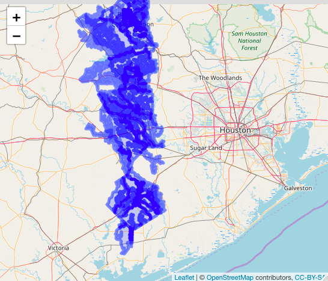

Start of pipeline for download geojson from FEMA map server on flood zone data for Harris county and surrounding areas.

Currently built to test locally, will be converting for cloud (i.e. multiple processes querying the mapserver, files stored in s3, etc.)

Some of the shapes mapped: .

The above shows that we should be able to get more comprehensive data from the map server to complete our current data set.